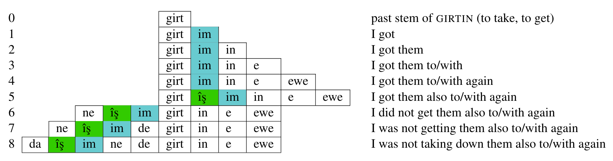

# Hunspell for Kurdish
## A morphological analyzer and spell checker for Kurdish in Hunspell

[Hunspell](http://hunspell.github.io/) is a spell checker and morphological analyzer originally designed for languages with rich morphology and complex word compounding. An open-source software, it is widely used by various web browsers and text editors. This repository contains an implementation of the Kurdish morphological rules and annotated lexicon for the task of spell-checking and morphological analysis. To use these functionalities, see  [Kurdish Language Processing Toolkit (KLPT)](https://github.com/sinaahmadi/klpt). Moreover, this spell-checker is currently being added as an extension to LibreOffice and OpenOffice and therefore, can be used within many text editors and browsers as well.

Please note that the current version only contains Sorani Kurdish data. Kurmanji data will be also provided in a near future. **It should also be note that the current project is the outcome of months of volunteer research and implementation. Please respect the terms of the license below.**

### Morphological rules

Sorani Kurdish morphology is notoriously complex. This is not only due to the number of affixes and clitics, but the way they appear and interact within a word-form. The following is an example on such a complexity for a single-word verb where the base *girt* of the verb *girtin* 'to take, to get' appears with clitics, suffixes and a verbal particle. The placement of the endoclitic *=îş* (in green boxes) and agent marker *=im* (in grey boxes) varies with respect to the base and each other in the verb form.

In order to extract morphological rules, the morphology of Sorani Kurdish is studied in a formal way in the paper entitled [ computational formalization of the Sorani Kurdish morphology](). This formalization allows various morpho-syntactic features of Sorani to be represented as rules which are presented in the [ckb-Arab.aff](ckb/ckb-Arab.aff) file. In version 0.1.0, inflectional and derivational rules regarding verbs, adjectives, adverbs and nouns are implemented. Next versions will include compound forms and further enrichments of the current categories.

### Lexicon annotation

As a rule-based method, Hunspell needs an annotated lexicon to which the morphological rules are applied. To this end, we use the lexicographic material provided by the [FreeDict project](https://freedict.org/) and [Wîkîferheng, the Kurdish Wiktionary](https://ku.wiktionary.org/). In addition, [Wikidata](https://www.wikidata.org) is consulted to extract proper names. The transliteration of the Latin-based script of Kurdish into the Latin-based one is carried out using [Wergor](https://github.com/sinaahmadi/wergor). Each lemma in the lexicon is manually tagged with part-of-speech, its formation type (derivational/inflectional) and further morphological properties. In addition, composing parts of compound forms are specified using a hyphen. This way, the annotated lexicon is also used within the [Kurdish Tokenization project](https://github.com/sinaahmadi/KurdishTokenization).

According to the morphological rules, lemmata in our lexicons are tagged using the following flags. If the flags don't make much sense to you, the part of speech tags, i.e. `po` flag, will hopefully do as they are provided according to the [Universal Dependency tags](https://universaldependencies.org/u/pos/index.html). The annotated lexicon is available at [ckb-Arab.dic](ckb/ckb-Arab.dic).

- `N`: Noun
- `V`: present stem of verbs
- `I`: past stem of intransitive verbs
- `T`: past stem of transitive verbs
- `A`: adjectives
- `R`: adverbs
- `E`: numerals
- `C`: conjunction
- `D`: interjection
- `B`: pronouns
- `E`: numerals
- `F`: adpositions
- `G`: particle
- `X`: infinitive
- `Z`: proper names
- `W`: irregular cases like *were* 'come.imp.2s'

The following is an example on how a few lemmata are tagged in our lexicon:

	فەوتێنرا/I po:verb is:past_stem_intransitive_passive
	فەوتێنران/XN po:verb is:infinitive_intransitive_passive
	فەوتێنرێ/V po:verb is:present_stem_intransitive_passive
	فەودە/ZN po:propn
	فەڕ/N po:noun
	فەڕاشە/N po:noun

### Cite this paper

There are two publications regarding this project which can be cited as follows:

	@ article{ahmadi2020Hunspell,
		title={{Hunspell for Sorani Kurdish Spell-checking and Morphological Analysis}},
		author={Ahmadi, Sina},
		year={2020},
		publisher={under review}
	}
	
	@article{ahmadi2020formalization,
	  title={{A computational formalization of the Sorani Kurdish morphology}},
	  author={Ahmadi, Sina},
	  year={2020},
	  publisher={under review}
	}

### Contribute
Are you interested in this project? Please follow the instructions of the [Kurdish Language Processing Toolkit (KLPT)](https://github.com/sinaahmadi/klpt) to get involved. Open-source is fun! 😊

### License

 This repository by <a xmlns:cc="http://creativecommons.org/ns#" href="https://github.com/sinaahmadi/klpt" property="cc:attributionName" rel="cc:attributionURL">Sina Ahmadi</a> is licensed under a <a rel="license" href="http://creativecommons.org/licenses/by-sa/4.0/">Creative Commons Attribution-ShareAlike 4.0 International License</a> which means:

- **You are free to share**, copy and redistribute the material in any medium or format and also adapt, remix, transform, and build upon the material
for any purpose, **even commercially**. 
- **You must give appropriate credit**, provide a link to the license, and indicate if changes were made. You may do so in any reasonable manner, but not in any way that suggests the licensor endorses you or your use.
- If you remix, transform, or build upon the material, **you must distribute your contributions under the same license as the original**. 

